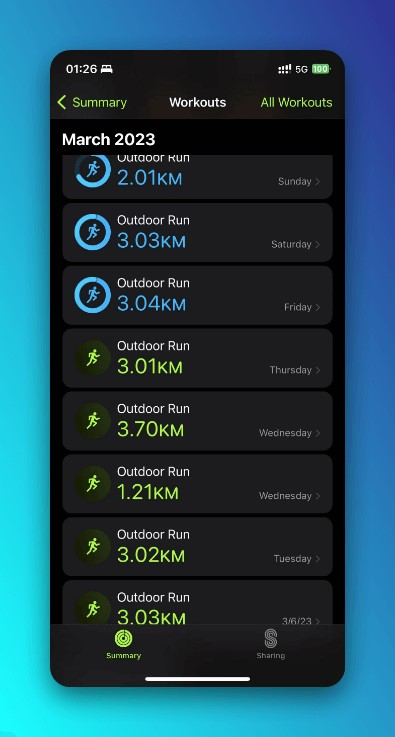
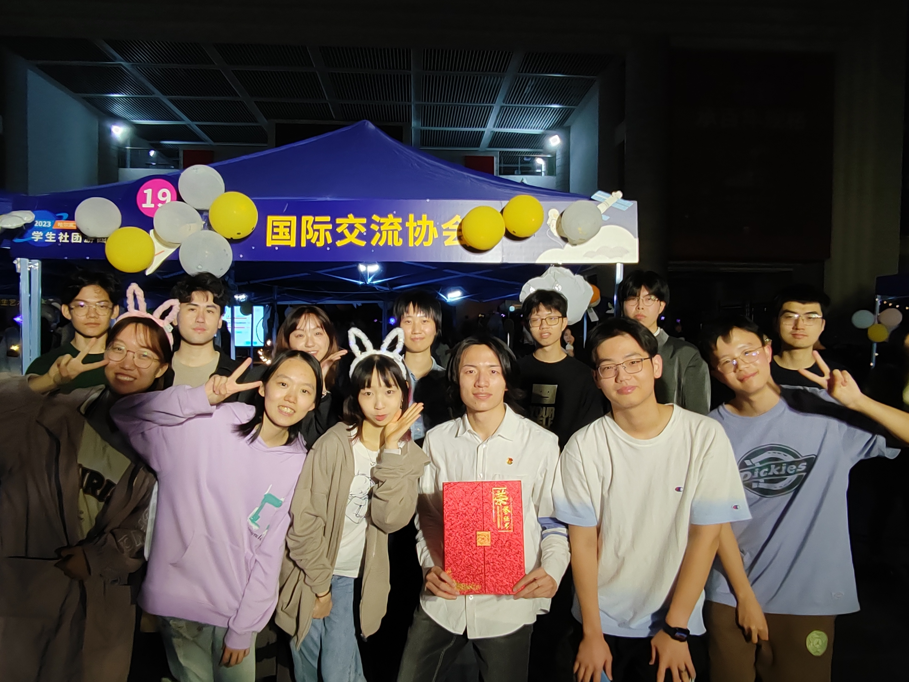



这周的大部分时间都在折腾自己的博客。这周还做了很多其他有意思的事情，运动量最大的一周，睡眠时间最少的一周，也是人际交往最多的一周。总的来说，这周在读一本小书的时候，同时有读到了许多蛮有意思的大书。
<!--more-->

## 折腾的路上不孤单

上周六闲着也是闲着，于是寻思顺便在原来的主题加入搜索引擎，以更好整理日后的内容。因为之前（直到昨天）还是在用[Pseudoyu](www.pseudoyu.com)的配置文件，看到yu介绍自己搭建过程的时候比较轻描淡写，加上之前有使用Cusdis的一些经验，于是产生了应该不是很难的错觉。

详细的配置过程已经在[为你的博客创建搜索引擎——Pagefind搭建指北](https://www.huang-zifeng.com/p/为你的博客创建搜索引擎pagefind搭建指北/)中分享。

首先，碰见了和我一样喜欢折腾但不是程式专长的[吳秉儒先生]([Pin 起來！ (pinchlime.com)](https://pinchlime.com/))，每次有一点小进度都欣喜向他报告。一个对生产力工具和部落格很有热枕的人。

后面通过电邮联系到了[Brycewray]([BryceWray.com](https://www.brycewray.com/))，一个写了Pagefind搭建指南的博主，因为他也碰到过，所以最开始怀疑是npx或者是CI的问题。

他在这方面提供了很多帮助。某种意义上也是第一次和老外写信来往。

最后在推上练习到了作者bglw，问题圆满解决。

高中学的写信的句式总算找到了用武之地。这种体验蛮有意思的，虽然自己只是一个自动化专业的学生，本可能这辈子都和前端无缘，但是在接触一个自己不熟悉的领域的时候还是得到了很多陌生人的热心帮助。作为接触的比较深入的第一个开源项目，在查issue、提issue的过程中也碰到了很多和我类似的问题，在这个角度来看，它让我第一次意识到了开源项目的魅力所在。这种开源的氛围至少在国内还不太浓厚，issue通常被当作吐槽、教产品经理做产品的平台，代码也一般会藏在私有仓库甚至本地管理。

## 生命中的第一个20公里

这周和朋友一起参加了机电学院的跑步活动，跑步本身是从初中开始就很喜欢的一项运动。但平时只会一周跑一次当作散心。这次跑步活动我和朋友每天一起跑3公里，3公里作为一个平时不会触碰的距离还是蛮有挑战性的，这周跑了7天，周末稍微偷了一下懒。但是自从跑了几天之后也慢慢适应了。跑步的时候听的最多的专辑是陈绮贞的《Groupies吉他手》，简单轻松，但又同时都充满了一种很舒服的哲理感。后面有一次还听起了博客，是一直很想了解的跳海酒馆。

 

## 游园会

疫情虽然夺走了三年的青春，但是没有夺走我们的游园会！虽然这次算是我们协会21级同学第一半参与的组织活动，有很多没有准备充分的地方，但是总的来说大家还是玩得很开心。

HSCIA是我在大学参加的归属感最浓厚的集体。我在这里认识了很多有意思的朋友，也参加了很多有意思的活动。希望未来HSCIA会大家的共同努力下越来越好。

## 最近在听🎧

谢安琪的「其实寂寞」

很喜欢里面的一句歌词

> 開餐一個人 不必等夠人 埋頭狂吃通粉不夠淋
