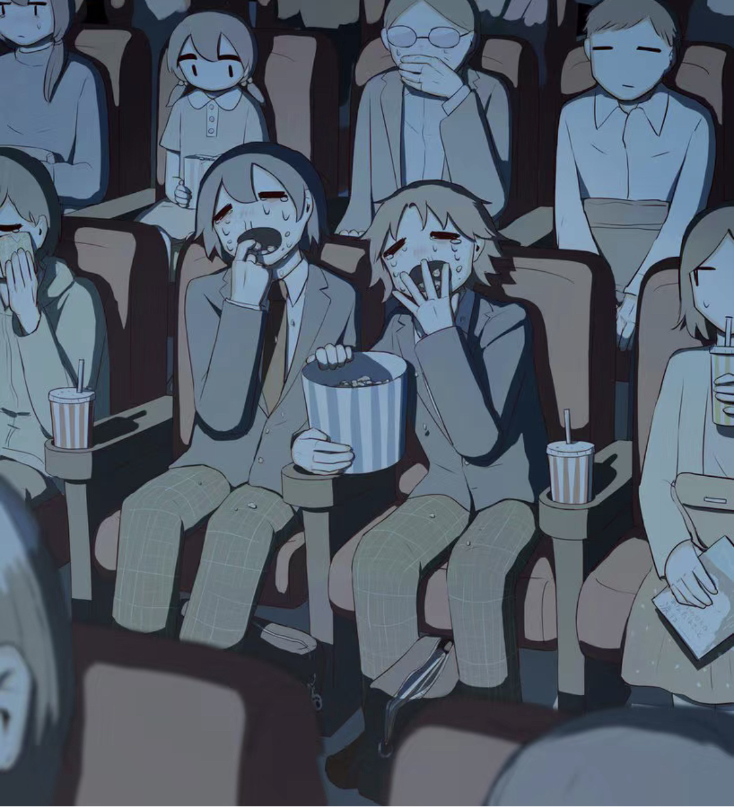

本篇是对4月生活的一些记录。记得三月的时候周报说过，希望4月不会是另外一个3月。所幸确实如此，没有烦人的作业和比赛，清静不少。值此良辰吉日，拾起废笔，略记一二有趣小事。

## 校园赛# 一群玩家的青春和散场

众所周知，彩虹六号是一款并非为众所周知的游戏。

大概是在22年4月的时候表白墙有人问有没有彩六群，当时学校老群已经奄奄一息，于是自己也就无聊随意建了一个新的小群。

第一次办校园赛的时候是威海校区的Maxwell找到了我，当时问我们有没有兴趣和他们一起进行跨校区比赛，殊不知那时已经是威海校区彩六群“彩六疲敝，危急存亡之秋”之时，自己便痛快答应，说先办一场深圳的比赛，然后暑假再和威海校区弄。现在看那时候群里的同学反响还是很积极的，甚至吸引了不少老群的同学来参加，但是经验不足，诚惶诚恐，只把人数限制到了20人/四支队，对外援做了不少限制，最终匆匆忙忙花了一个星期的准备时间，在一个晚上进行玩了所有的比赛，第二天又匆匆解散了赛事活动群。

很可惜的一点是，那时候威海校区的Maxwell，教头还有玉米在OB和解说方面帮了我们不少的忙但是却没有给他们参与比赛的机会，没有邀请朋友zq和他的朋友来参加，以及由于赛程太过短暂，选手们的实力和比赛精彩的地方很难体现出来，赛后的交流群被匆匆解散，大家都没来得及好好复盘......

Maxwell甚至帮我们写了解说稿

> 随着xxx的倒下，SZH(说脏话)获得了本届校园赛的冠军，而我想说的是，漫漫人生路并没有最终的成功，也没有致命的失败，有的只有不断前进的勇气，TNC(奶淇淋)队在本次比赛中同样令人尊敬，打出很多亮眼的表现，只希望在未来的日子里说双方能够在彩六道路上越走越远。祝愿深圳校区彩六能够越办越好，跃入人海，我们顶峰相见。

总之总之，遗憾太多了，于是下定了还要办第二次的决心。

第二届是最近发生的事，反倒不想太详细记录了，就如同这场比赛诞生的命运一样——甚至在比赛开始的前一个晚上，我还和威海选区的教头讨论之后都同意不如不办，主要原因是威海校区那边的兄弟已经”疲敝“地凑不出五个人了。后来在学弟Mirage的推动下我们还是办成了这次比赛。Max和教头也上阵了，Tabby如愿以偿地打满了两天，一场bo1和一场bo3，大家的遗憾都已经荡然无存。附带一提，总决赛那天虽然Tabby他们队配合如同职业一般强力，但是诃德拿下了29杀更是把比赛的精彩推到了另一个高度。

校园赛见证了我们与彩六相挂钩的那部分青春。也谨以此篇作为HIT彩六协会(~~地下组织~~)的记忆。

## 插画集# 愛せる誰か

最近开始喜欢上了插画，转载一些来自[@avogado6](www.avogado6.com)的插画

 

 

 

希望五月，努力地，投入地，呼吸剩下的春天。

现在是下午四点十六，作业还没开始写，出门右转自习室。
