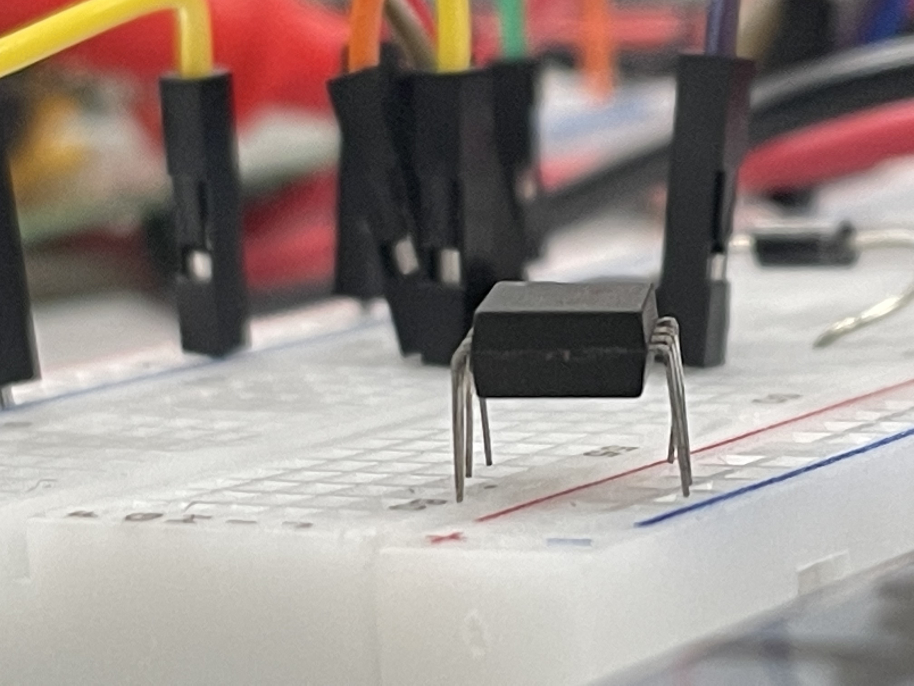
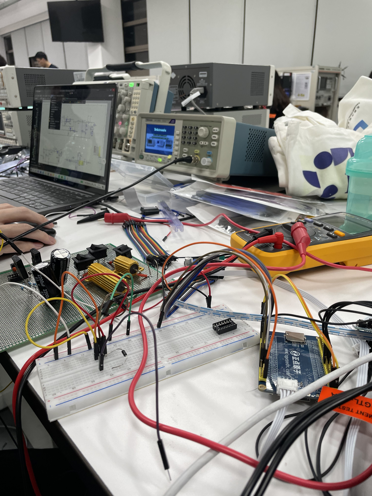

这周周报一反以往夜半三更时的更新时间，早早就写了，主要是回到宿舍想到与其玩游戏倒不如记录一下这周生活哈哈。

## EDC初尝试

这几天参加了学校举办的EDC(电子设计竞赛)，题目基本和全国题差不多，我们选择的是E题，要设计一个双向DC-DC变换器，虽然因缘巧合之下着是上周我们练习时就讨论过的一道题目，但是实际上手起来发现难度还是相当有的。就拿电路设计部分来说，虽然已经学会了基本的Buck电路和Boost电路，但是在芯片选型和完整设计这一块自己却没有任何的思路可言。最后只是在程序上帮了点小忙，用之前学过但是没实践过的结构体特性设计了一个PID控制器。不确定性也蛮多的：烧录程序的时候keil闪退、芯片无法识别，甚至[卡在main函数执行之前](https://www.huang-zifeng.com/随想/)，我们总是在奇怪的地方卡住。电路方面更是如此：IR2104高端使能低端没有输出波形(可能表述的不准确不要怪我balabala，但确实是一反芯片手册上的设计)，最后用贴片的IR2104方才成功，电容/MOS不知道那里击穿，只能逐个重新更换焊接来排查......

这次下来感觉自己的能力还是很缺失的，但是所幸遇到了很友善的学长向我解释各种知识，也在技术栈上添加了ADC、矩阵键盘这样的小外设。如果学长之后没有找我我也不会奇怪，毕竟自己确实没有体现很大的作用。但是至少这次知道了自己缺失怎样的能力，也算是收获之一。

 

## 不确定性碎碎念

1# 前天中午从图书馆出来准备吃午饭的时候看见路边的树上结满了Sakura，路上一反平时的单调色彩，遂于午饭后决定拍下，发圈的时候忽然想起到一年前的同一天自己也拍下了Sakura的照片！一对比，噫~怎么感觉少了点东西，还真是，一年前大沙河两边开满的Sakura如今只剩下稀零零的一小片，但是如果是从别的角度拍，也能有很好看的效果。

2# 耳机😣耳机😰这学期数不清是第几次丢了

3# 每次去实验室都能在经过的活动中心听到风格各异的演唱，也许有一场我不知道的活动，抛开时间的维度自己至少也在相同的地方听到了一样的音乐。

刚开始想写的时候还是想到蛮多的，但是写到现在发现怎么憋不出来了。

## 书影音

本周久违地看了一部电影《哈利·波特与魔法石》

没有听什么新的音乐，在听Hikaru Utada

这几周都蛮忙的，希望四月不会是另一个三月。

> I wish I would stop blaming myself for things that are beyond my control.
> ——Geloy Concepcion
